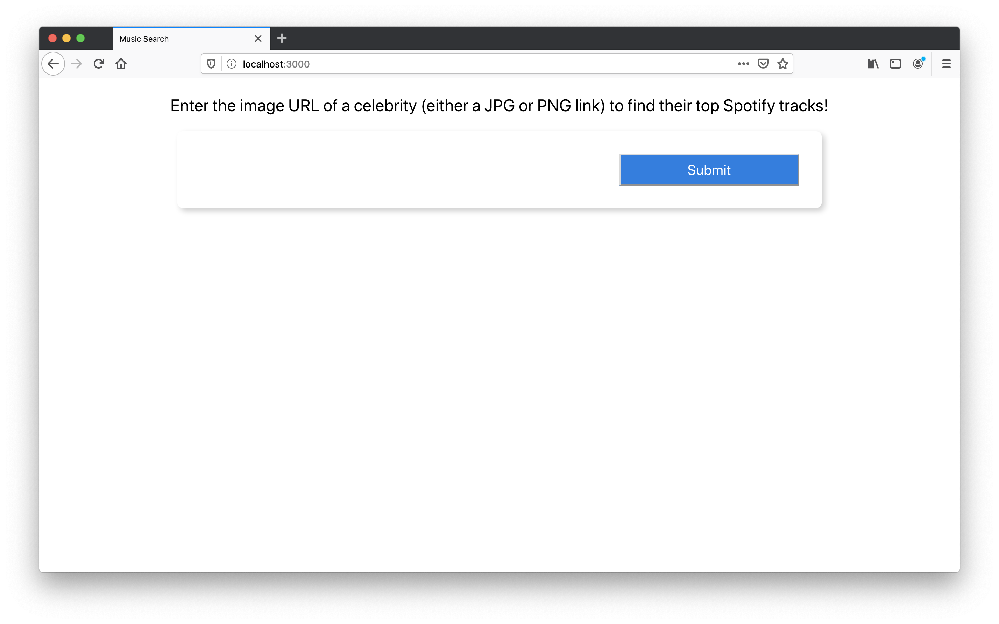
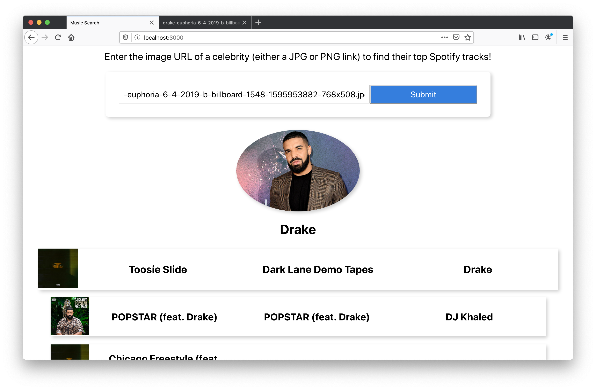
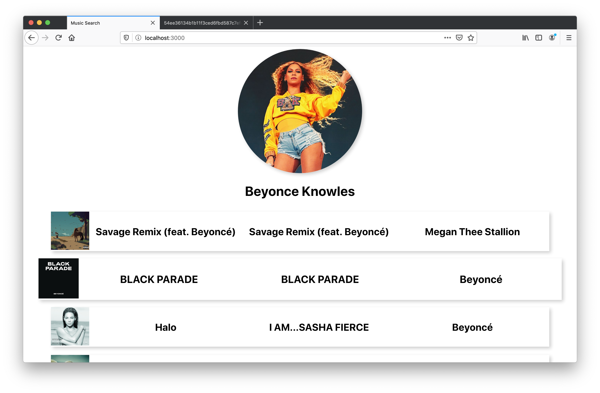

#  Celebrity Music Search

This project was created for the HobbyHacks hackathon hosted by TechTogether in July 2020.  It is a web app built with React and a python Flask backend. Using face recognition technology, a user can enter an image URL of a celebrity to find their top Spotify tracks!

First, get a client and secret key from [Spotify](https://developer.spotify.com/dashboard/applications).

To run the app locally:
1. clone the repository
2. open 2 terminal windows: one in celeb-music-search and one in api
3. In api terminal window enter the following to start the Flask app:
- pip install -r requirements.txt
- export SPOTIPY_CLIENT_ID='ENTER YOUR CLIENT ID'
- export SPOTIPY_CLIENT_SECRET='ENTER YOUR CLIENT SECRET'
- python app.py
4. In celeb-music-search window enter the following to start the React app:
- npm install
- npm start

